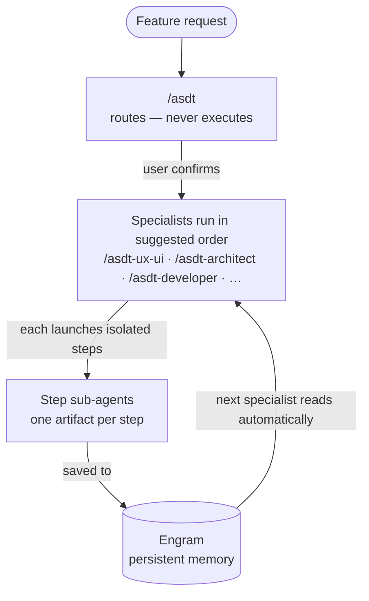

# AI Software Delivery Team

Ship features the way a real team would — architect, developer, QA, security, UX — even when you're building alone.

ASDT installs a team of AI specialists into Claude Code or OpenCode. Each specialist owns a distinct discipline and hands its work to the next through structured artifacts — the architect's decision informs the developer's plan, the developer's code informs the QA's tests. Without ASDT, AI assistants have no enforced discipline around how a feature gets designed, built, or reviewed.

## How It Works



Each specialist orchestrates its own isolated steps. Steps that produce artifacts run as separate sub-agents so they don't pollute each other's context. Artifacts are saved to [Engram](https://github.com/Gentleman-Programming/engram) — not to files on disk — so specialists can run minutes or days apart and still pick up where the last one left off.

## Requirements

- Claude Code (`claude`) or OpenCode (`opencode`) installed
- [Engram MCP server](https://github.com/Gentleman-Programming/engram) installed and running
- Go 1.22+ to install from source

## Installation

```sh
curl -fsSL https://raw.githubusercontent.com/vitualizz/asdt/main/install.sh | bash
```

Downloads the pre-built binary for your platform (Linux/macOS, x86_64/arm64) and installs it to `~/.local/bin/`. No Go required.

## Getting Started

**1. Install skills into your AI assistant**

```sh
asdt-tui
```

Interactive TUI that checks Engram is installed, lets you choose which AI assistant(s) to target, and copies the ASDT skills into them. Each specialist is installed as its own top-level directory — e.g. `~/.claude/skills/asdt-architect/` — so each is independently invocable.

**2. Initialize your project**

Open your AI assistant in the project directory and run:

```
/asdt-init
```

The assistant will detect your project stack, ask a few configuration questions, and write `.asdt/config.yaml` and `.asdt/knowledge/platform.yaml`.

**3. Start Engram, then use the specialists**

ASDT uses [Engram](https://github.com/Gentleman-Programming/engram) as its memory layer. Each specialist saves its artifacts there, and the next specialist retrieves them by change name. Engram must be running before you invoke any specialist — artifacts from one run must survive until the next.

Follow the [Engram setup guide](https://github.com/Gentleman-Programming/engram) to install and start the MCP server, then configure it in your assistant's MCP settings.

## Using the Specialists

Invoke from inside your AI assistant:

| Command | What it does | Produces |
|---|---|---|
| `/asdt` | Meta-orchestrator — analyzes your request, recommends which specialists to run and in what order | Routing suggestion |
| `/asdt-init` | Initialize ASDT for the project — detects stack, writes config | `.asdt/config.yaml`, `platform.yaml` |
| `/asdt-architect` | Architecture decisions, system design, risk analysis | Architecture Decision Record + system design |
| `/asdt-developer` | Implementation plan with code and test snippets | Step-by-step implementation plan |
| `/asdt-qa` | Test plan and acceptance criteria | Test cases, quality report |
| `/asdt-security` | Threat model and hardening checklist | Security findings, hardening checklist |
| `/asdt-ux-ui` | User flows, component specs, responsive strategy | UX brief, component spec |

Each specialist reads prior artifacts from Engram automatically — the developer finds the architect's decisions, the QA finds the developer's plan.

Start with `/asdt` if you are unsure which specialist to invoke.
