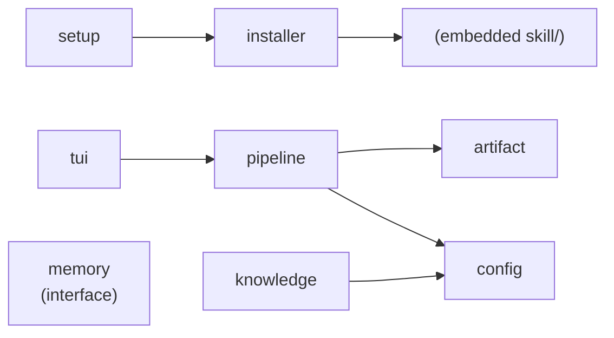

# internal/

Private packages for the `asdt-tui` binary — the installer TUI users run to copy ASDT skills into their AI assistant.

The AI specialist logic lives in `skill/`. This directory is the Go tooling that delivers those skills to the user's machine.

## Packages

| Package | Responsibility |
|---|---|
| `installer/` | Copy skills from the embedded filesystem to the assistant's skills directory |
| `setup/` | Bubbletea TUI — the interactive installer UI |
| `tui/` | Status observer TUI — panels showing specialist run state and artifacts |
| `config/` | Read/write `.asdt/config.yaml`; walk-up discovery from CWD to project root |
| `knowledge/` | Detect the project's tech stack from the filesystem (no LLM involved) |
| `artifact/` | YAML artifact store under `.asdt/artifacts/{change}/` |
| `memory/` | Provider interface for cross-session memory (current impl: Engram) |
| `pipeline/` | FSM tracking which specialists have run per change |

## Key Relationships

**`installer/`** is the bridge between the embedded skill files and the user's machine. It reads `skill/` from the binary's embedded filesystem (`go:embed`) and writes each specialist directory to `~/.claude/skills/` or `~/.config/opencode/skills/`. One `InstallResult` is returned per assistant — failure for one does not abort others.

**`pipeline/`** implements specialist run state as a sequential FSM. `FSMachine` reads and writes `pipeline-state.yaml` under `.asdt/artifacts/{change}/`. The v2 format tracks state per specialist independently rather than as a single linear sequence.

**`memory/`** defines a `Provider` interface. The current implementation delegates to Engram via MCP. Swapping the memory backend requires only a new `Provider` implementation — no specialist logic changes.

**`knowledge/`** runs at `/asdt-init` time to detect the project stack by inspecting the filesystem (`go.mod`, `package.json`, `pyproject.toml`, etc.). No LLM call is made. The result is written to `.asdt/knowledge/platform.yaml` and read by every specialist before doing any work.

## Dependency Graph

