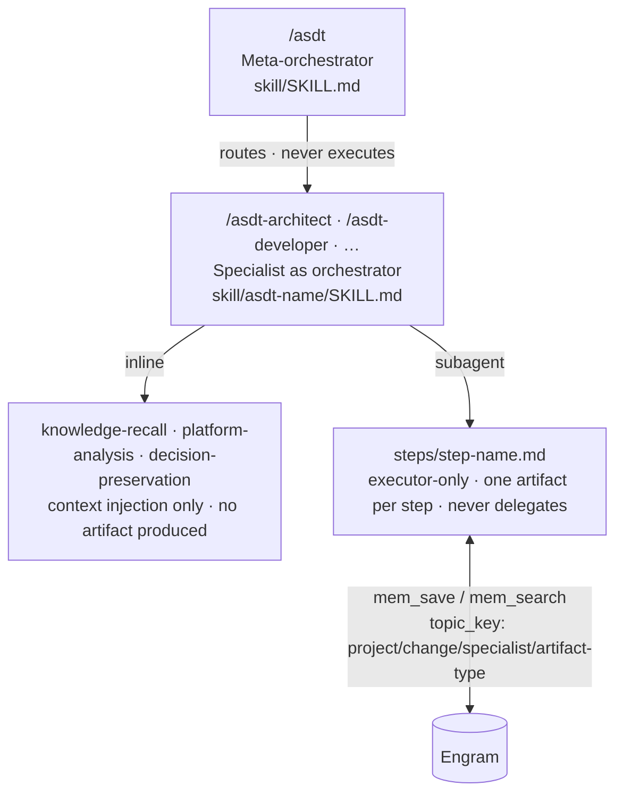

# ASDT Skills

This directory contains everything installed into the AI assistant. The Go binary (`asdt-tui`) copies these files into `~/.claude/skills/` (Claude Code) or `~/.config/opencode/skills/` (OpenCode) at install time.

## Three-Layer Execution Model



**Meta-orchestrator** (`skill/SKILL.md`) — the `/asdt` command only. Analyzes the request, assesses complexity, recommends which specialists to invoke and in what order. Never executes a single specialist step.

**Specialist as orchestrator** (`skill/asdt-{name}/SKILL.md`) — reads `workflow.yaml` and drives the steps. Does not do the specialist work itself — it tells the calling assistant which steps to run inline and which to launch as isolated sub-agents.

**Step sub-agents** (`skill/asdt-{name}/steps/*.md`) — executor-only. Each step does one thing, produces one artifact, saves it to Engram, and returns. Steps never delegate further.

## Directory Structure

```
skill/
├── SKILL.md                    ← meta-orchestrator (/asdt)
├── embedded.go                 ← go:embed — bundles this dir into the binary
├── asdt-{name}/                ← one directory per specialist
│   ├── SKILL.md                ← orchestration plan (ORCHESTRATOR GATE + step table)
│   ├── workflow.yaml           ← step registry: name, execution mode, inputs, outputs
│   ├── steps/                  ← sub-agent prompt files (one per subagent step)
│   │   └── {step-name}.md
│   └── skills/                 ← reference docs loaded into specific steps (optional)
│       └── {reference}.md
├── asdt-shared/
│   └── skills/                 ← cross-specialist utilities (see asdt-shared/skills/README.md)
└── asdt-init/                  ← project initializer (/asdt-init)
```

## Step Execution Modes

Every step in `workflow.yaml` has an `execution:` field:

| Mode | What it means | Produces an artifact? |
|---|---|---|
| `inline` | Runs in the orchestrator's context — pure context injection | No |
| `subagent` | Launched as an isolated sub-agent | Yes — one artifact per step |

**Inline steps** (`knowledge-recall`, `platform-analysis`, `decision-preservation`) inject context into the orchestrator's thread. They have no `inputs:` or `output_topic_key` — they enrich context for the next step.

**Subagent steps** each declare:
- `inputs:` — topic keys to retrieve from Engram before starting
- `output_topic_key` — where to save the produced artifact in Engram
- `reference_skills:` — which shared skill files to load as guidelines

## Artifact Topic Keys

Every artifact is stored in Engram under a structured key:

```
{project}/{change}/specialist/artifact-type

Examples:
  myapp/add-auth/architect/constraints-analysis
  myapp/add-auth/architect/adr
  myapp/add-auth/developer/dev-spec
```

This naming lets the next specialist retrieve a specific artifact unambiguously via a single `mem_search` call.

## Adding a New Specialist

1. Create `skill/asdt-{name}/` with `SKILL.md`, `workflow.yaml`, and `steps/`
2. Add the ORCHESTRATOR GATE block to `SKILL.md` — copy from any existing specialist
3. Declare each step in `workflow.yaml` with `execution:`, `inputs:`, `output_topic_key:`
4. Write one `steps/{step-name}.md` per `subagent` step — it must start with the executor-header from `asdt-shared/skills/executor-header.md`
5. Register the specialist in `skill/SKILL.md` §5 (Specialist Registry)
